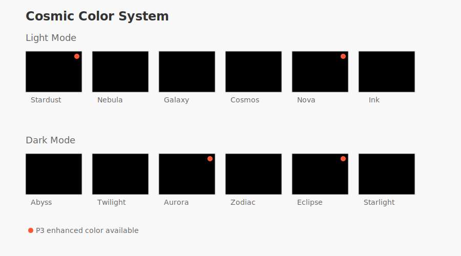

# Cosmic Color System

A modern color system using OKLCH color space, optimized for both standard and P3 displays, with light and dark modes.

## Light Mode Colors

### Primary Colors

- **Stardust** (`--color-stardust`) - Primary background color, pure white with subtle warmth
- **Galaxy** (`--color-galaxy`) - Primary purple, rich and deep with extended P3 gamut support
- **Ink** (`--color-ink`) - Main text color, near-black with subtle purple undertone

### Secondary Colors

- **Nebula** (`--color-nebula`) - Secondary background/surface color, warm light gray
- **Cosmos** (`--color-cosmos`) - Secondary accent, muted mauve
- **Nova** (`--color-nova`) - Warm peach accent with P3 enhancement
- **Void** (`--color-void`) - Deep purple-black, used for subtle contrasts

## Dark Mode Colors

### Primary Colors

- **Abyss** (`--color-abyss`) - Primary background color, deep purple-black
- **Aurora** (`--color-aurora`) - Primary purple with P3 enhancement
- **Starlight** (`--color-starlight`) - Main text color, near-white with warm undertone

### Secondary Colors

- **Twilight** (`--color-twilight`) - Secondary background/surface color
- **Zodiac** (`--color-zodiac`) - Secondary accent, light mauve
- **Eclipse** (`--color-eclipse`) - Light peach accent with P3 support
- **Moonlight** (`--color-moonlight`) - Light warm gray

## Typography

The system uses a carefully selected combination of modern variable fonts:

- **Sans-serif** (`--font-sans`): Plus Jakarta Sans Variable
- **Serif** (`--font-serif`): Fraunces Variable
- **Monospace** (`--font-mono`): Fira Code Variable

## P3 Color Enhancement

On displays supporting the P3 color gamut, these colors receive enhanced vibrancy:

- Galaxy (Light mode purple)
- Nova (Light mode peach)
- Aurora (Dark mode purple)
- Eclipse (Dark mode peach)

## Accessibility

All color combinations meet WCAG 2.1 AA standards for contrast:

- Light mode text (Ink on Stardust): 4.90:1
- Dark mode text (Starlight on Abyss): 5.15:1
